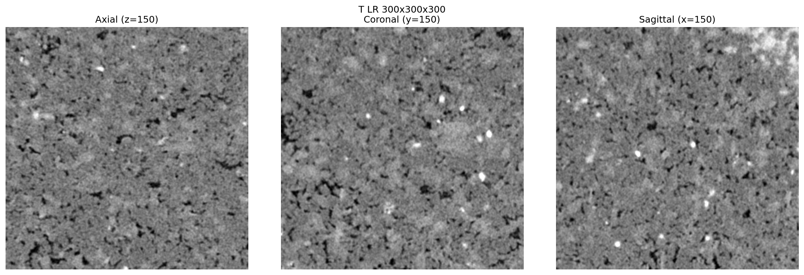
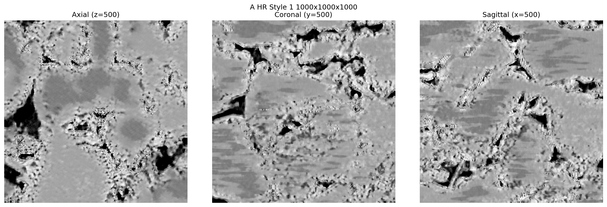
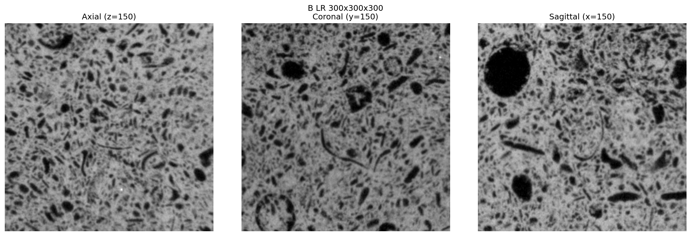

# DeepMicroscopy

Deep learning framework for multiscale and multimodal microscopy data fusion using MUNIT (Multimodal Unsupervised Image-to-Image Translation).

## Features

- Seamless integration of unpaired imaging datasets from different modalities and resolutions
- Robust many-to-many mappings preserving uncertainty and diversity
- Support for both 2D and 3D microscopy data

## Dataset

The microscopy datasets used in this study are available at:

**Download from Zenodo: [10.5281/zenodo.15692401](https://doi.org/10.5281/zenodo.15692401)**

After downloading, extract the RAW files to the `data/` directory:
```bash
data/
├── A_LCT_6.4um_8bu_310x310x310.raw
├── A_LCT_6.4um_8bu_400x400x1000.raw
├── A_MCT_1.0um_8bu_200x200x200.raw
├── A_MCT_1.0um_8bu_1300x1300x1800.raw
├── A_SEM_200nm_8bu_25000x25000.raw
├── B_LCT_26.88um_8bu_310x310x310.raw
├── B_LCT_26.88um_8bu_600x600x890.raw
├── B_MCT_4.20um_8bu_600x600x5700.raw
└── T_LCT_6.4um_8bu_310x310x310.raw
```

## Dataset Overview

Three datasets are used in this study:
- **Dataset A**: Sandstone sample for training
 - LCT: 6.4 μm resolution (400×400×1000)
 - MCT: 1.0 μm resolution (1300×1300×1800)
 - SEM: 200 nm resolution (25000×25000)
- **Dataset B**: Carbonate rock sample for training
 - LCT: 26.88 μm resolution (600×600×890)
 - MCT: 4.2 μm resolution (600×600×5700)
- **Test Data**: All 310×310×310 volumes
 - A_LCT: 6.4 μm (310×310×310) - Sandstone A test subset
 - B_LCT: 26.88 μm (310×310×310) - Carbonate B test subset
 - T_LCT: 6.4 μm (310×310×310) - Independent sandstone sample

## Data Preparation

Generate training patches from the larger training volumes:

```bash
# Sandstone A: LCT to MCT super-resolution (6.4× enhancement)
python gen_train_data.py --config configs/A_LCT2MCT.yaml

# Sandstone A: MCT to SEM cross-modality translation (5× enhancement)
python gen_train_data.py --config configs/A_MCT2SEM.yaml

# Carbonate B: LCT to MCT super-resolution (6.4× enhancement)
python gen_train_data.py --config configs/B_LCT2MCT.yaml
```

## Model Training

Train three specialized models using the full-size training data:

```bash
# Train 3D super-resolution model for sandstone
python train.py --config configs/A_LCT2MCT.yaml

# Train 2D cross-modality model (CT to SEM)
python train.py --config configs/A_MCT2SEM.yaml

# Train 3D super-resolution model for carbonate rock
python train.py --config configs/B_LCT2MCT.yaml
```

## Model Testing

### 1. Sandstone A Test Subset
```bash
python test.py \
   --config configs/A_LCT2MCT.yaml \
   --checkpoint ./experiments/a_train_lct2mct/checkpoints/gen.pt \
   --input-file ./data/A_LCT_6.4um_8bu_310x310x310.raw \
   --input-size 310 310 310 \
   --output-dir ./experiments/a_test_lct2mct \
   --mode 3d \
   --scale-factor 6.4 \
   --num-styles 2
```

### 2. Cross-Sample Generalization Test
```bash
python test.py \
   --config configs/A_LCT2MCT.yaml \
   --checkpoint ./experiments/a_train_lct2mct/checkpoints/gen.pt \
   --input-file ./data/T_LCT_6.4um_8bu_310x310x310.raw \
   --input-size 310 310 310 \
   --output-dir ./experiments/t_test_lct2mct \
   --mode 3d \
   --scale-factor 6.4 \
   --num-styles 2
```

### 3. Cross-Modality Translation (CT to SEM)
```bash
python test.py \
   --config configs/A_MCT2SEM.yaml \
   --checkpoint ./experiments/a_train_mct2sem/checkpoints/gen.pt \
   --input-file ./data/A_MCT_1.0um_8bu_200x200x200.raw \
   --input-size 200 200 200 \
   --output-dir ./experiments/a_test_mct2sem \
   --mode 2d \
   --scale-factor 5.0 \
   --num-styles 2
```

### 4. Carbonate B Test Subset
```bash
python test.py \
   --config configs/B_LCT2MCT.yaml \
   --checkpoint ./experiments/b_train_lct2mct/checkpoints/gen.pt \
   --input-file ./data/B_LCT_26.88um_8bu_310x310x310.raw \
   --input-size 310 310 310 \
   --output-dir ./experiments/b_test_lct2mct \
   --mode 3d \
   --scale-factor 6.4 \
   --num-styles 2
```

## Visual Results Comparison

### Sandstone A Super-Resolution (LCT→MCT)
<table align="center">
 <tr>
   <td align="center" colspan="3"><b>Input (Low Resolution)</b></td>
 </tr>
 <tr>
   <td align="center" colspan="3"></td>
 </tr>
 <tr>
   <td align="center" colspan="3"><b>Style 0 (Medium Resolution)</b></td>
 </tr>
 <tr>
   <td align="center" colspan="3"></td>
 </tr>
 <tr>
   <td align="center" colspan="3"><b>Style 1 (Medium Resolution)</b></td>
 </tr>
 <tr>
   <td align="center" colspan="3"></td>
 </tr>
</table>

### Cross-Sample Generalization (Model A → Sample T)
<table align="center">
 <tr>
   <td align="center" colspan="3"><b>Input (Low Resolution)</b></td>
 </tr>
 <tr>
   <td align="center" colspan="3"></td>
 </tr>
 <tr>
   <td align="center" colspan="3"><b>Style 0 (Medium Resolution)</b></td>
 </tr>
 <tr>
   <td align="center" colspan="3"></td>
 </tr>
 <tr>
   <td align="center" colspan="3"><b>Style 1 (Medium Resolution)</b></td>
 </tr>
 <tr>
   <td align="center" colspan="3"></td>
 </tr>
</table>

### Cross-Modality Translation (MCT→SEM)
<table align="center">
 <tr>
   <td align="center" colspan="3"><b>Input (CT)</b></td>
 </tr>
 <tr>
   <td align="center" colspan="3"></td>
 </tr>
 <tr>
   <td align="center" colspan="3"><b>Style 0 (SEM-style)</b></td>
 </tr>
 <tr>
   <td align="center" colspan="3"></td>
 </tr>
 <tr>
   <td align="center" colspan="3"><b>Style 1 (SEM-style)</b></td>
 </tr>
 <tr>
   <td align="center" colspan="3"></td>
 </tr>
</table>

### Carbonate Rock Super-Resolution (LCT→MCT)
<table align="center">
 <tr>
   <td align="center" colspan="3"><b>Input (Low Resolution)</b></td>
 </tr>
 <tr>
   <td align="center" colspan="3"></td>
 </tr>
 <tr>
   <td align="center" colspan="3"><b>Style 0 (Medium Resolution)</b></td>
 </tr>
 <tr>
   <td align="center" colspan="3"></td>
 </tr>
 <tr>
   <td align="center" colspan="3"><b>Style 1 (Medium Resolution)</b></td>
 </tr>
 <tr>
   <td align="center" colspan="3"></td>
 </tr>
</table>

## Results Summary

| Test Case | Model Trained On | Test Data | Resolution Enhancement | Purpose |
|-----------|------------------|-----------|----------------------|----------|
| A test | A (400×400×1000) | A (310³) | 6.4× (6.4μm → 1.0μm) | Validate training |
| T test | A (400×400×1000) | T (310³) | 6.4× (6.4μm → 1.0μm) | Test generalization |
| A CT→SEM | A (MCT→SEM) | A (200³) | 5× (1.0μm → 200nm) | Cross-modality |
| B test | B (600×600×890) | B (310³) | 6.4× (26.88μm → 4.2μm) | Different rock type |


## Output Files

Each test generates:
- `*_LR_*.raw`: Low-resolution input (300×300×300 after border cropping)
- `*_HR_style0_*.raw`: High-resolution output (1920×1920×1920, style 0)
- `*_HR_style1_*.raw`: High-resolution output (1920×1920×1920, style 1)
- `*.png`: Visualization of middle slices
- `processing_info.txt`: Detailed processing parameters